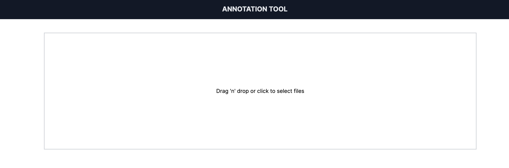

# Assignment used for Frontend Engineer position
This task is intended for candidates applying for a Frontend Engineer position at the Visma Machine Learning team. The assignment is built around the technologies and stack used in the production environments of the team, and the problem is a toy version of some of the tasks we face.

  

## The problem
Imagine you're building an Annotation tool for a Machine Learning project. Annotation tool is a crucial part of the Machine Learning pipeline, as it allows to create labeled datasets for training the models. The goal of the tool is to allow users to annotate certain fields in the documents and save the annotations into a JSON file. This data is then used to train the models, but this will not be a part of this task.

Your goal is to create a simple Annotation tool. The tool should allow users to upload images of invoices and receipts, and provide them with a UI to manually annotate certain fields in the documents in a form of a group of simple input fields.

We are supporting following file types:
- Images: `.jpg`, `.jpeg`, `.png`
- PDFs: `.pdf` - optional, but handling multipage PDFs will *definitely* earn you extra points

The tool should allow users to:
- Upload files
- Annotate required fields
- Save the annotations into a JSON file on the local machine (here you can get creative ;)

Annotation fields that are required:
- Supplier name
- Date of the purchase
- Total amount
- Currency - should be selected from a list of supported currencies (EUR, NOK, SEK, DKK)

JSON output should include all fields and should be saved as `{example_name}.json`. 

You can find files to test the tool in the `examples` folder.

## Requirements
- The tool should be built with React or Next.js - pick wisely and be prepared to explain your choice :) 
- The tool should be built with TypeScript
- Feel free to use UI libraries like MUI, Tailwind CSS, etc.
- Keep the solution simple and lightweight, but do not hesitate to use libraries that you consider useful (for example for handling forms)
- Either include a `Dockerfile` with the neccessary setup to deploy the app to a cloud environment, or come up with a plan on how to deploy the app - the choice of runtime is yours, just make sure you explain your solution (you can go crazy here)
- Do not forget to include a README file with instructions on how to run the project
- Including tests will earn you extra points

## Sources
* [What we do in Visma Machine Learning?](https://vml.visma.ai/)

## Inspiration

Here is an example of how the tool could look like. You can use it as an inspiration, but feel free to come up with your own design.

  

  

